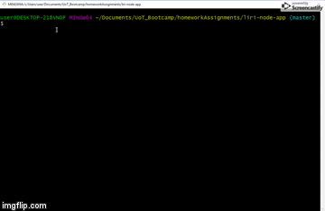
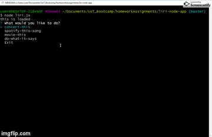
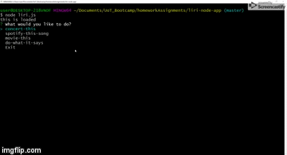
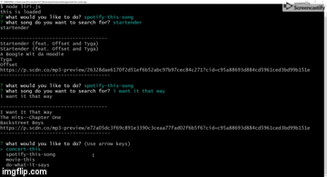

# liri-node-app

## What is Liri Bot?
LIRI Bot node application (Language Interpretation and Recognition Interface) that is able to search for different movies, spotify songs and 
concerts through a user friendly command line interface. 

## Run/Execute this Bot
A few things to note to ensure this application works as intended: 
1. Having Nodejs installed on your local machine.
    - Since there is no front-end web interface to this app, node must be installed to be able to execute it on your local machine. 
    - You will have to generate your own client ID and client secret with spotify and place them in the .env file.        
    (https://developer.spotify.com/documentation/general/guides/app-settings/)
2. Git clone this repository to your local machine. "git clone https://github.com/jessendasilva1/liri-node-app.git"
3. Navigate to the cloned repo
4. Type "node liri.js" without quotes to start the program
5. Choose from one of the 4 options listed under your terminal to start
- 

## Features
This LIRI Bot application is able to execute 4 different commands: 

1. concert-this
- 

    - This option will allow you to search for a specific artist and it will return all the concerts of that artist that are coming up. 
    - Returns the Date, Time, Venue Location, Country and the Artists name

2. spotify-this-song
- 

    - This option will allow you to search for a song by the track name. It will return the track name, artist(s), preview link of the song and the album it is from.
    - Holding CTRL + clicking on the preview link will open your web browser and give you a 30sec preview of the song
    - (The song preview is very loud and plays once the link is clicked. Be aware. )
    - If you dont enter a song, liri-bot will show you its favorite song

3. movie-this
- 

    - This option allows you to search for a movie and have liri-bot return you the top movie result. 
        1. Movie title
        2. Year of the Movie
        3. IMDB Rating
        4. Rotten Tomatoes Rating
        5. Country the movie was produced in
        6. Language(s) the movie is in
        7. Quick plot summary
        8. Actors in the movie
    - If you do not enter a movie title, liri-bot will show you its favorite movie of all time

4. do-what-it-says
    - Is currently not working and experiencing bugs
